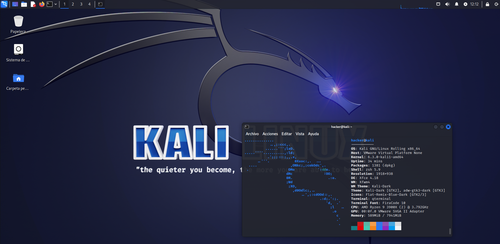

<h1 align="center">
    <a href="#"></a>
    <br />
    <span>⍑ ≡ Ի Ի ⍙</span>
    <br />
    <br />
    <a href="https://github.com/cosasdepuma/terra/issues">
        
    </a>
    <a href="https://github.com/cosasdepuma/terra/stargazers">
        
    </a>
    <a href="https://github.com/cosasdepuma/terra">
        
    </a>
    <br/>
    <a href="https://www.packer.io/">
        
    </a>
    <br/><br/>
</h1>

<div align="center">
<hr/>

```ocaml
🖥️ VMWare Player / VMWare Workstation 🖥️ 
```

<hr/>
<h1></h1>
</div>

The following is a list of available machines for **unattended** installation:

<details>
<summary>🐉 <a href="https://www.kali.org/">Kali Linux</a> (Dragon)</summary>
<br/>

## ✏️ Details

<div align="center">

```
minimal installation
```
```hs
Name :: Kali Dragon
User :: hacker
Pass :: hacker
```

</div>

## 🏗️ Deployment

In order to deploy the machine, it is necessary to have `packer` installed:

```sh
# deployment process
packer build kali/kali.pkr.hcl
```

## 🖼️ Screenshoots

<div align="center">
    
</div>
</details>